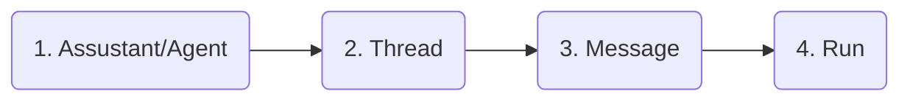

# Demo OpenAI API

## Create a virtual python environment
- `virtualenv -p python3.11 env_name`
- `python -m venv env_name`

---
## Create a file listing all required dependencies of the Python project
    pip freeze > requirements.txt

## Install dependencies from requirements.txt:
    pip install -r requirements.txt
    
---
## How to create an assistant/agent

### High Level Components

### Code Example
```python
# Create an assitant
assistant = client.beta.assistants.create(
    name="Math Tutor",
    instructions="You are a personal math tutor. Write and run code to answer math questions.",
    tools=[{"type": "code_interpreter"}],
    model="gpt-4-1106-preview",
)

# Create a thread
thread = client.beta.threads.create()

# Create a message
message = client.beta.threads.messages.create(
    thread_id=thread.id,
    role="user",
    content="I need to solve the equation `3x + 11 = 14`. Can you help me?",
)

...

# Finally run
run = client.beta.threads.runs.retrieve(thread_id=thread.id, run_id=run.id)

```


---
## References:
- [OpenAI Assistants API](https://platform.openai.com/docs/assistants/overview)
- [OpenAI Python Code Examples](https://github.com/openai/openai-python/blob/main/examples)